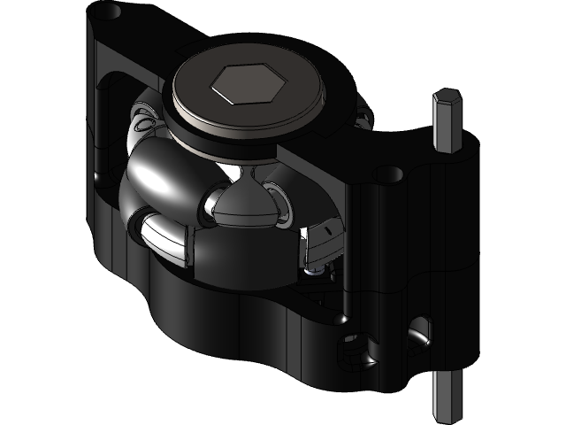
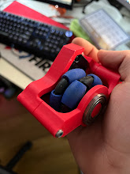
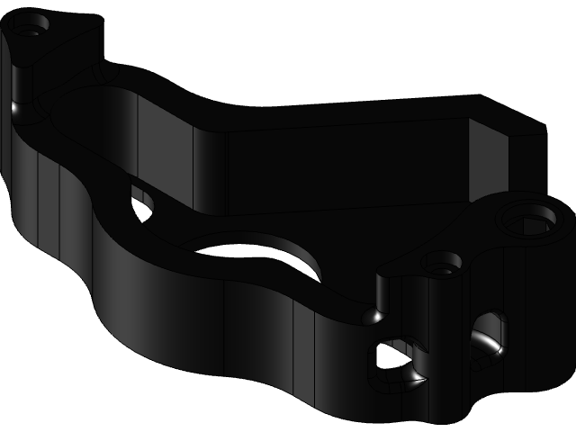
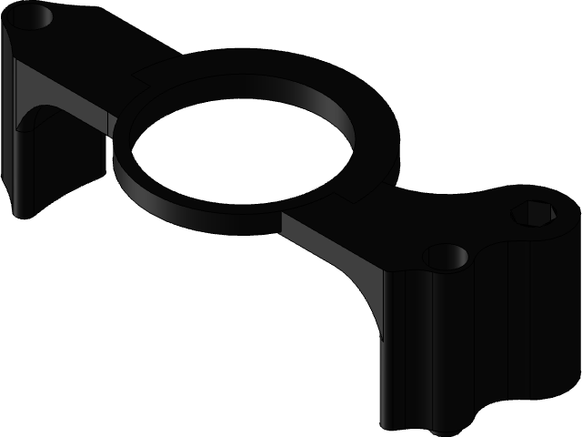

<div align="center">

# Tubba Odometry

### A compact dead-wheel odometry module for FTC robots

[](https://www.firstinspires.org/robotics/ftc)
 

**Designed by [Angelo Demetroulakos](https://grabcad.com/angelo.demetroulakos-1) · FTC Team 9384**

[Download CAD](cad/) · [View the BOM](#bill-of-materials) · [Original GrabCAD model](https://grabcad.com/library/tubba-odometry-for-ftc-1)

</div>

<p align="center">
  
</p>

---

## What is Tubba?

Tubba is a compact odometry pod developed by FTC Team 9384. It gives a robot a passive tracking wheel whose rotation can be measured independently from the drivetrain, providing the motion data used by localization systems such as Road Runner.

The design is built around an AndyMark **2 in. Dualie Omni Wheel** in the **1/2 in. hex / 50A** configuration and a REV Through Bore Encoder. It was designed to fit inside the parallel plate structure of Team 9384's 2023–2024 robot, **EggWUUUHH**.

> [!NOTE]
> The STEP assembly is the source of truth for geometry. Printer settings, tolerances, encoder wiring, and robot specific mounting dimensions were not included with the original release; validate the model against your hardware before manufacturing.

## Highlights

- Compact, plate mounted FTC odometry module
- 2 inch omni tracking wheel for low lateral scrub
- Absolute encoder based wheel measurement
- Individual STEP files plus a complete assembly
- Source BOM with direct vendor links
- Open hardware released under an attribution required license

## Gallery

<table>
  <tr>
    <td width="50%"><br><sub><b>Physical prototype</b></sub></td>
    <td width="50%"><br><sub><b>Complete assembly</b></sub></td>
  </tr>
  <tr>
    <td><br><sub><b>Sensor plate</b></sub></td>
    <td><br><sub><b>Outer plate</b></sub></td>
  </tr>
</table>

## Repository layout

```text
.
├── assets/images/                 # Original photos and GrabCAD renders
├── archive/
│   └── tubba-odometry-grabcad.zip # Complete source snapshot
├── cad/
│   ├── 9384 odom final v1.step    # Complete assembly
│   ├── sensor plate.step           # Encoder-side plate
│   ├── outter plate.step           # Outer plate (original filename)
│   ├── hex shaft mod.step          # Modified shaft model
│   └── IMG_0381.jpg                # Original source photo
├── docs/BOM.csv                   # Machine-readable bill of materials
├── CITATION.cff                   # Citation metadata
└── LICENSE                        # Creative Commons Attribution 4.0
```

## Bill of materials

The list below is for **one module** and mirrors the original Team 9384 BOM. Prices are the source values from March 2024 and may have changed.

| # | Component | Supplier | Part number | Qty. | Source cost |
|---:|---|---|---|---:|---:|
| 1 | 3D printed parts | This repository | — | 1 per part | — |
| 2 | [Through Bore Encoder](https://www.revrobotics.com/rev-11-1271/) | REV Robotics | REV-11-1271 | 1 | $48.00 |
| 3 | [2 in. Dualie Omni Wheel — 1/2 in. hex, 50A](https://www.andymark.com/products/2-in-dualie-omni-wheel) | AndyMark | — | 1 | $15.50 |
| 4 | [1/2 in. hex ID × 1.125 in. OD shielded flanged bearing](https://www.andymark.com/products/0-5-in-hex-id-1-125-in-od-shielded-flanged-bearing-fr8zz-hexhd) | AndyMark | FR8ZZ-HexHD | 1 | $6.50 |
| 5 | [5 mm hex shaft](https://www.revrobotics.com/5mm-Hex-Shafts/) | REV Robotics | REV-41-1362-PK4 | 1 | $11.50–$21.50 |
| 6 | [3 mm surgical tubing](https://www.revrobotics.com/rev-41-1163/) | REV Robotics | REV-41-1163 | 1 | $7.00 |
| 7 | [M3 × 45 mm socket-head bolts](https://www.amazon.com/dp/B0967ZTRXB) | Amazon | — | 1 pack | $8.99 |
| 8 | [M3 nuts](https://www.amazon.com/dp/B0CR3S4MZT) | Amazon | — | 1 pack | $8.99 |

**Estimated sourced total:** **$106.48–$116.48**, excluding printed material, shipping, and tax. The purchase quantities for fasteners and shaft stock may leave enough material for more than one module.

The original spreadsheet remains available [on Google Sheets](https://docs.google.com/spreadsheets/d/17jjdt58DgWxnq1DswMJ4VjZQLS4xurBlHhdxET_VKbg/edit?usp=sharing), and a portable copy is included at [`docs/BOM.csv`](docs/BOM.csv).

## Getting started

1. Download or clone this repository.
2. Open `cad/9384 odom final v1.step` in your CAD package to inspect the full assembly.
3. Compare the component models with the hardware you intend to buy.
4. Adapt the mounting geometry to your robot and verify clearances through the full suspension travel.
5. Manufacture the required parts, assemble the module, and calibrate wheel diameter and encoder direction in your localization code.

## Design notes

- STEP is vendor neutral and can be imported by Onshape, Fusion, SolidWorks, Inventor, FreeCAD, and most modern CAD systems.
- The filename `outter plate.step` is intentionally preserved from the original GrabCAD package so checksums and source history remain easy to trace.
- FTC field performance depends on preload, wheel wear, surface conditions, alignment, and calibration. Test repeatability on the actual competition robot.

## Attribution and license

This project is licensed under the **[Creative Commons Attribution 4.0 International License](LICENSE)**. You may copy, manufacture, modify, and redistribute the design—including commercially—but you **must credit the creator**, link to the license, and indicate whether you made changes.

Suggested attribution:

> **Tubba Odometry** by Angelo Demetroulakos / FTC Team 9384, licensed under CC BY 4.0. Source: https://grabcad.com/library/tubba-odometry-for-ftc-1

See [`LICENSE`](LICENSE) for the exact notice and license link.

## Credits

Designed and published by **Angelo Demetroulakos** for **FTC Team 9384**. The original model was published on GrabCAD on March 16, 2024.

<div align="center">

Built for teams that would rather spend their time driving than guessing where the robot is.

</div>
